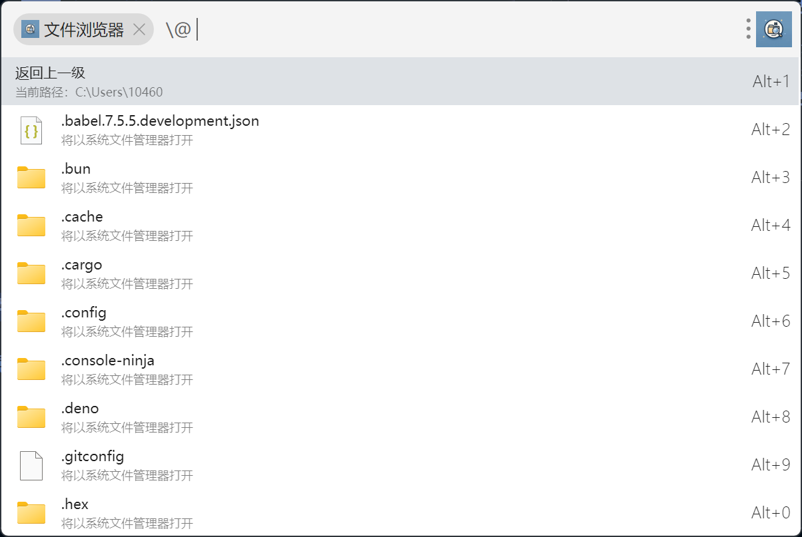
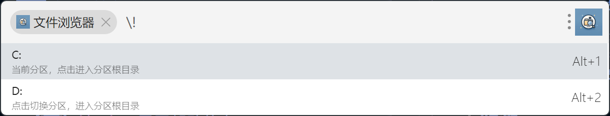
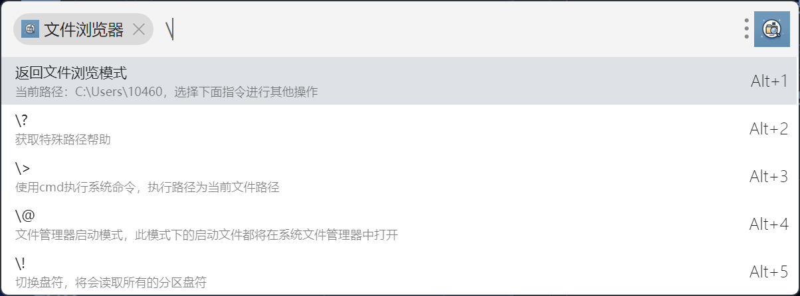

# utools-file-browser

一个文件浏览器插件，基于 [uTools](https://u.tools/)。

## 功能列表

- [x] 读取文件目录
  - [x] 若当前在文件管理器中，则读取当前目录
  - [x] 若当前不在文件管理器中，则读取$HOME 目录
- [x] 搜索文件
  - [ ] `\+` 模糊搜索
    - [x] regex
    - [ ] ~~批量操作~~
- [x] 快速访问文件
  - [x] 采用默认软件打开
- [ ] 支持指令系统
  - [x] `\@`: 在默认文件管理器打开文件或文件夹，支持搜索
  - [x] `\!`: 浏览并切换盘符(Windows Only)
    - [x] 支持搜索
  - [x] `\?`: 显示帮助信息
  - [x] `\>`: 运行系统指令，目前默认采用 cmd(Windows)
  - [ ] `\,`: 设置功能
    - [x] 是否显示隐藏文件
    - [x] 是否显示文件大小
    - [ ] ~~是否显示文件类型~~
  - [ ] `\^`: 排序功能
    - [x] 全局排序
    - [x] `\^+$type` 局部排序
      - [x] 支持搜索

## TODO

- [ ] 重构指令系统
  - [ ] 封装指令系统
  - [ ] 是否需要改变指令系统激活关键字

## 功能截图

## 致谢

感谢汉堡大佬的 LOGO

